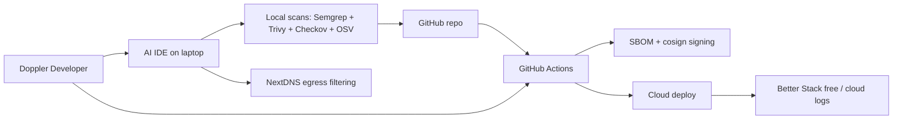
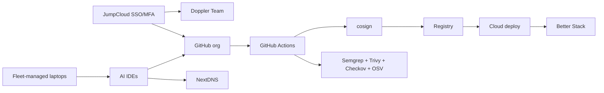
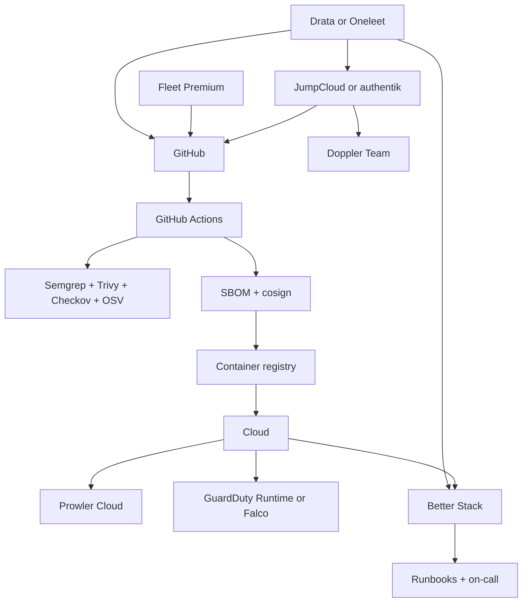
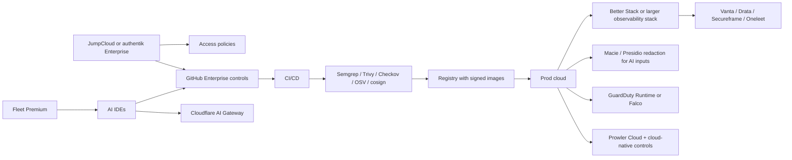

# Security Architecture for Startups Building With AI Coding Tools

## Threat landscape

The core security problem in AI-assisted development is not “the model” in isolation. It is **ambient authority**: untrusted text from repos, issues, docs, web pages, MCP servers, and extensions can now influence an agent that has access to code, terminals, files, secrets, cloud credentials, and deployment paths. OWASP’s 2025 LLM Top 10 puts prompt injection, sensitive information disclosure, supply chain, data poisoning, improper output handling, excessive agency, and system prompt leakage at the center of GenAI risk; MITRE ATLAS similarly catalogs direct and indirect prompt injection, plugin compromise, jailbreaks, data leakage, prompt self-replication, and model supply chain compromise as first-class adversary techniques. Anthropic’s MCP security guidance explicitly warns that MCP connectors increase the blast radius when they can reach external systems or secrets. citeturn18view0turn18view1turn17search1turn1view0turn3search0

For a startup serving individual developers and tiny teams, the most important AI-specific threats are these:

| Threat | Why it matters in AI-assisted dev | OWASP and ATLAS mapping | Practical consequence | Sources |
|---|---|---|---|---|
| Direct prompt injection and jailbreaks | The developer or attacker can push an agent into unsafe behavior simply by changing the prompt or surrounding instructions. | OWASP LLM01, LLM06, LLM07; ATLAS AML.T0051 and AML.T0054. | Agent runs unsafe commands, writes insecure code, or bypasses intended restrictions. | citeturn18view0turn17search1 |
| Indirect prompt injection via repos, issues, PRs, docs, web pages, and MCP/tool output | The attacker does not need chat access; they only need content the agent will later ingest. MITRE distinguishes this as indirect prompt injection. Orca’s 2026 RoguePilot research showed a malicious GitHub issue could steer Copilot in Codespaces and exfiltrate a privileged token for repository takeover. | OWASP LLM01, LLM05, LLM06; ATLAS AML.T0051, AML.T0053, AML.T0050. | “Drive-by” compromise of agentic workflows from issue text, README text, or tool responses. | citeturn17search1turn11view0turn3search0 |
| Package hallucination and slopsquatting | Code LLMs invent package names. The 2025 USENIX paper found an average hallucination rate of at least 5.2% for commercial models and 21.7% for open-source models across 576,000 generated samples, creating a novel package-confusion path. | OWASP LLM03, LLM09; ATLAS AML.T0062 and classic supply-chain abuse. | Developer installs a fake package because the assistant sounded confident. | citeturn41view0 |
| Malicious MCP servers, plugins, and extensions | MCP and IDE extensions are effectively privileged plugins. MCP’s own security guidance emphasizes OAuth, authorization, token handling, and tool isolation; OWASP flags insecure plugin design and excessive agency as core risks. | OWASP LLM06 and plugin-related risks; ATLAS AML.T0053. | Tool compromise becomes code exfiltration, remote command execution, or cloud credential abuse. | citeturn3search0turn17search1turn18view1 |
| Model and extension supply chain compromise | AI coding users install extensions and GitHub Actions faster, with less review. CISA documented the 2025 `tj-actions/changed-files` compromise affecting over 23,000 repositories. In 2026, GitHub said a poisoned VS Code extension on an employee device led to unauthorized access to internal repositories. | OWASP LLM03 plus classic software supply-chain risk. | One compromised action, extension, or tool update can expose CI secrets or source. | citeturn36search0turn36search3turn10search16turn10search14 |
| Secret and code-context leakage to model providers | Cursor says requests still pass through Cursor’s backend even with a user API key, and that turning off Privacy Mode allows use and storage of codebase data, prompts, snippets, and editor actions; with Privacy Mode on, it enables zero-data-retention for model providers. GitHub Copilot documents that prompts and metadata can go to OpenAI, Anthropic, Google Cloud, Azure, or Fireworks depending on model/plan. Anthropic says opted-in chats or coding sessions may be retained in de-identified form for up to five years. | OWASP LLM02 and LLM07. | Sensitive code, credentials, customer data, or internal topology leaks outside your control boundary. | citeturn44view0turn44view1turn44view2turn44view3 |
| Context poisoning and rules backdoors | AI tools now trust “local instructions” such as repo rules, issue descriptions, hidden comments, or memory. Researchers keep finding that legacy IDE behaviors plus agent autonomy create exploitable chains. | OWASP LLM04, LLM05, LLM06, LLM07; ATLAS prompt injection and data leakage techniques. | Attackers shape future outputs by poisoning the context the agent treats as trusted. | citeturn11view0turn12search3turn18view0 |

The faster teams move with AI, the more classic AppSec problems get amplified. Veracode’s 2025/2026 GenAI code security work found that only 55% of generation tasks produced secure code, meaning known flaws were introduced in about 45% of cases. CodeRabbit’s 2025 report found AI-generated pull requests had about **1.7× more issues** than human-written PRs, with security issues roughly **1.5–2×** as common. GitGuardian’s 2026 report found **28.65 million** new hardcoded secrets in public GitHub commits in 2025, an **81%** year-over-year surge in leaked AI-service secrets, and **24,008** unique secrets exposed in MCP-related config files; it also found internal repositories were about **6×** more likely than public repos to contain hardcoded secrets. citeturn13search0turn13search9turn13search1turn15view0

The right mental model is to map AI-assisted dev onto both **OWASP LLM risks** and **traditional AppSec**:

| Dev workflow | Dominant LLM risks | Amplified classic risks | What to assume |
|---|---|---|---|
| Planning and prompting | Prompt injection, misinformation, overreliance | Threat-model omissions, unsafe design choices | Model suggestions are advisory, not architecture review. citeturn18view0turn18view1 |
| Coding in IDE / agent mode | Prompt injection, excessive agency, output handling, system prompt leakage | XSS, SSRF, auth flaws, crypto misuse, insecure defaults | AI can write working code that is still insecure. citeturn13search0turn13search9turn18view1 |
| Pull requests, issues, review comments | Indirect prompt injection, context poisoning | Reduced human review quality, approval fatigue | Treat all issue and PR text as untrusted input to the coding agent. citeturn11view0turn17search1 |
| Dependencies and packages | Supply chain, hallucination, insecure plugin design | Dependency confusion, typosquatting, vulnerable components | Every package suggestion must be verified against a real registry and SBOM policy. citeturn41view0turn18view0 |
| CI/CD and publish | Excessive agency, output handling, plugin compromise | CI secret leakage, compromised actions, release tampering | Pin actions by commit SHA, use OIDC, and sign artifacts. citeturn36search0turn36search3turn37search2turn37search9turn29search1 |
| MCP and extensions | Insecure plugin design, excessive agency | Endpoint compromise, token theft, lateral movement | MCP servers and IDE extensions are privileged code. Treat them like production integrations. citeturn3search0turn17search1 |

The notable incidents that matter most for your product thesis are not hypothetical. In 2025, the `tj-actions/changed-files` GitHub Action compromise exposed CI/CD secrets at scale and triggered a CISA alert. In September 2025, GitGuardian documented the **GhostAction** campaign, which affected **327** GitHub users across **817** repositories and exfiltrated **3,325** secrets. In late 2025, researchers disclosed **IDEsaster**, reporting over **30** vulnerabilities and **24 CVEs** across AI IDEs and coding assistants, with every tested product vulnerable in that research set. In February 2026, Orca’s **RoguePilot** showed repository takeover from a malicious GitHub issue in Codespaces. In May 2026, GitHub publicly acknowledged a compromise of an employee device involving a poisoned VS Code extension. At the ecosystem level, the Shai-Hulud campaigns drove GitHub/npm to shorten token lifetimes, revoke classic tokens, and push OIDC trusted publishing. citeturn36search0turn36search3turn36search2turn12search3turn11view0turn10search16turn10search14turn37search2turn37search9

My opinionated takeaway is simple: **the defendable wedge is not generic “AI security.” It is securing the seam between the AI coding assistant, the developer workstation, the repo, the MCP/plugin ecosystem, and the deployment pipeline.** That seam is where today’s mainstream AppSec and cloud tools are weakest. citeturn11view0turn12search3turn15view0turn3search0

## Security domains

The winners for this market are the tools that are **OSS-first, fast to adopt, low-noise, and automation-friendly**. Tiny teams do not need the broadest platform. They need the shortest path from “AI wrote it” to “I trust it enough to ship.” The table below favors that bias.

| Domain | Practical controls that actually matter | OSS-first winner | Paid winner | Rough cost | Third-party LLM egress | Why I would pick it | Sources |
|---|---|---|---|---|---|---|---|
| AI and LLM application security | Treat repo text, issue text, MCP/tool output, and docs as untrusted; isolate prompts; validate every output before execution; sandbox terminal and file writes; require approval for privileged actions. | **promptfoo** — open-source evals and red teaming. | **Cloudflare AI Gateway** — centralized logging, rate limits, caching, fallback, and control plane. | promptfoo: $0 community. Cloudflare: provider pass-through plus 5% unified billing, Workers/logging fees as needed. | promptfoo: **conditional**; depends on the model provider you test. Cloudflare: **yes**, prompts transit Cloudflare and your model provider. | Start with red-team tests, not “guardrails” marketing. Then add a gateway only when you need observability and policy. | citeturn31search0turn31search9turn31search7turn31search1 |
| Code security | Fast SAST in IDE and CI, baseline rule packs, branch protection, PR comments only on high-confidence findings, no auto-merge on AI fixes. | **Semgrep CE**. | **Semgrep AppSec Platform**. | Free for CE; AppSec pricing publicly starts at Code $30/contributor/mo, Supply Chain $30/contributor/mo, Secrets $15/contributor/mo, with Code and Supply Chain free for orgs with 10 or fewer monthly contributors. | Core scanning: **no**. | Best developer ergonomics and best path from solo to startup without switching engines. | citeturn32search2turn32search4turn32search8turn19search0turn19search8 |
| Supply chain | Lockfiles mandatory; verify package existence before install; scan manifests and images; generate SBOMs; sign artifacts; pin GitHub Actions by full SHA. | **OSV-Scanner + cosign**. | **Snyk Open Source**. | OSS: $0. Snyk: public plans start at $25/mo. | OSS: **no**. Snyk core SCA: **no**. | OSV is lightweight and easy; cosign gives artifact integrity; Snyk is the easiest paid upgrade with broad workflow coverage. | citeturn30search0turn30search14turn29search1turn29search16turn28search1 |
| Infrastructure as code | Scan Terraform, CloudFormation, Kubernetes, and Helm before merge; policy-as-code for guardrails; fail only on high-severity or internet-facing misconfig. | **Checkov**. | **Snyk IaC**. | Checkov: $0. Snyk plans start at $25/mo with IaC included in paid tiers. | Checkov: **no**. Snyk core scanning: **no**. | Checkov remains the best standalone OSS IaC scanner; Snyk is the least-friction paid path for small teams. | citeturn28search0turn28search3turn28search1 |
| Containers and images | Base-image minimization, distroless where practical, image scan in CI, SBOMs, image signing, registry admission policy. | **Trivy**. | **Docker Scout**. | Trivy: $0. Docker Pro $9/mo, Team $15/user/mo annual. | Both: **no** for core scanning. | Trivy is the best Swiss-army knife in this stack; Docker Scout is pragmatic if your team already lives in Docker. | citeturn42view0turn19search3turn19search15 |
| Cloud | Continuous posture checks, low-noise misconfig triage, least privilege on IAM, OIDC federation for CI/CD, avoid static cloud keys. | **Prowler OSS**. | **Prowler Cloud**. | OSS: $0. Prowler Cloud: usage-based, resource- or scan-based. | No public third-party LLM requirement. | Prowler is the most startup-friendly path into CSPM without buying an enterprise suite too early. | citeturn25search12turn25search0 |
| Runtime | Runtime detection for containers and hosts, alert on shell spawns, crypto miners, reverse shells, unexpected network connections, secrets file access. | **Falco**. | **AWS GuardDuty Runtime Monitoring** if you are on AWS. | Falco: $0. GuardDuty: usage-based; AWS’s own example shows small EKS runtime coverage around $24/month for four workloads. | No. | Falco is the OSS default; GuardDuty is the practical paid choice if your whole world is already AWS. | citeturn26search1turn26search17turn26search12turn26search3 |
| Secrets management | Remove secrets from code, use short-lived tokens, centralize app secrets, rotate automatically where possible, use OIDC trusted publishing. | **Infisical OSS**. | **Doppler Team**. | Infisical OSS: self-host cost only. Doppler: free for 3 users on Developer, then $8/additional user; Team $21/user/mo. | Core secrets management: **no**. | Doppler has the best startup UX among tools with transparent pricing; self-host Infisical when data control matters more than speed. | citeturn20search3turn22view0turn37search9 |
| Identity and access | SSO, MFA, SCIM when the team grows, security keys or passkeys for admins, just-in-time elevation, remove “shared admin” accounts entirely. | **authentik**. | **JumpCloud SSO**. | authentik OSS: self-host cost only; managed authentik starts around $16/mo from third-party managed hosting, while official enterprise is $5/user/mo and Enterprise Plus starts at $20k annually. JumpCloud SSO: $11/user/mo annual. | No public third-party LLM requirement. | For small teams, self-hosted authentik is surprisingly strong; if you want speed without ops, JumpCloud is the clean paid choice. | citeturn23search17turn23search11turn23search2turn23search0 |
| Data security | Encrypt at rest and in transit, separate tenants hard at the app layer, scan buckets for PII, redact prompts before external models, minimize retention. | **Microsoft Presidio**. | **Amazon Macie**. | Presidio: $0. Macie: $0.10/bucket/mo plus data-inspection fees; first 1 GB/month analyzed is free. | Presidio: **no**. Macie: **no**. | Presidio solves prompt/data redaction; Macie finds where your bucket sprawl is already violating your assumptions. | citeturn27search0turn27search3turn27search1turn27search4 |
| Developer workstation | Disk encryption, auto-lock, local posture checks, lightweight MDM, DNS or proxy egress controls for AI tools and extensions, no long-lived cloud creds on laptops. | **Fleet Free**. | **Fleet Premium** plus **NextDNS Pro** for lightweight egress filtering. | Fleet Free $0; Fleet Premium $7/host/mo; NextDNS Pro $1.99/mo personal, business custom. | No public third-party LLM requirement. | The laptop is now a high-value attack surface for agentic workflows; Fleet is the cleanest endpoint baseline for startups. | citeturn24search0turn24search2turn24search3turn20search9 |
| Observability and detection | Central logs, one alerting path, service health, deployment markers, audit logs from CI/CD and IdP, low-volume but actionable anomaly detection. | **Grafana Loki**. | **Better Stack**. | Loki OSS: self-host cost only. Better Stack response/on-call starts at $29/responder/mo; telemetry has a free start. | Better Stack core telemetry: no public third-party LLM requirement for core observability. | Better Stack is the best “small-team Datadog replacement” if you want one on-call path without six products. | citeturn34search5turn34search8turn20search0 |
| Incident response | Markdown runbooks in Git, one escalation path, credential-rotation playbooks, evidence preservation, fast customer comms templates. | **Runbooks-as-code in GitHub**. | **Better Stack incident management**. | GitHub private repo: effectively free on small plans; Better Stack starts at $29/responder/mo. | No public third-party LLM requirement for the core workflow. | Tiny teams should not buy a heavyweight IR platform first. Shared runbooks plus one paging lane beats complexity. | citeturn20search0 |

A few privacy calls matter enough to be explicit. **Cursor** can be reasonably safe only when teams intentionally enable Privacy Mode and understand that requests still traverse Cursor’s backend; without Privacy Mode, Cursor may store codebase data, prompts, snippets, and editor actions to improve features and train models. **GitHub Copilot** has strong enterprise governance and zero-data-retention arrangements with some providers, but prompts and metadata still go to the relevant hosting clouds or model providers depending on feature and plan. **Anthropic** has materially different retention behavior depending on product and settings. In other words: **“uses my API key” is not the same thing as “my code never leaves.”** citeturn44view0turn44view1turn44view2turn44view3

My opinionated buying rule is this: **buy identity, secrets, and one source of truth for alerts earlier than you buy fancy AI security platforms.** The reason is that most severe AI-coding incidents today still cash out as stolen secrets, poisoned dependencies, unsafe deploys, and compromised endpoints—not as abstract “model harm.” citeturn15view0turn36search0turn36search2turn10search16

## SDLC mapping

This is the pipeline I would design for your ICP. The goal is not “maximum coverage.” It is **high-confidence friction** at the exact moments AI adds risk.

| SDLC stage | Controls | Tools and integration method | Free vs paid | False-positive friendliness | Representative sources |
|---|---|---|---|---|---|
| Plan and threat model | Lightweight per-feature threat model; classify data; decide whether AI agents may touch prod-like secrets or customer data; define approved MCP servers and package registries. | Markdown threat model template in repo; promptfoo scenario tests in CI for sensitive workflows. | Free at first. | High, because this is mostly human judgment plus targeted tests. | citeturn31search0turn18view0turn17search1 |
| Code in IDE | Local SAST, misconfig, dependency, and secret checks; code assistant privacy settings enforced; agent approval for terminal commands outside project scope. | Semgrep CE in VS Code/JetBrains; Trivy local filesystem scans; Cursor Privacy Mode or Copilot enterprise policies. | Mostly free. | Good if you keep rulesets narrow and only show new findings. | citeturn32search2turn32search12turn42view0turn44view0turn44view2 |
| Commit and pull request | Branch protection; signed commits where practical; PR checks only on delta; package name verification against lockfile and registry; no AI auto-merge. | Pre-commit hooks or local scripts; GitHub Actions running Semgrep, Checkov, Trivy, OSV-Scanner. | Free to low-cost. | Medium-to-good if you fail on severity and changed files only. | citeturn32search12turn28search0turn42view0turn30search5 |
| Build and CI | Pin all actions by full commit SHA; OIDC to cloud and npm; no static CI secrets; generate SBOM; sign artifacts and images. | GitHub Actions with pinned actions; npm trusted publishing with OIDC; cosign signing; Trivy SBOM/image scan. | Free to low-cost. | High if you keep blocking logic focused on exploitable or high-severity paths. | citeturn36search0turn36search3turn37search2turn37search9turn29search1turn42view0 |
| Artifact and registry | Signed image verification; distroless or minimal base; registry policy rejects unsigned or critically vulnerable artifacts. | cosign verify in deploy pipeline; Docker Scout or Trivy in registry checks. | Free to moderate. | High when focused on “unsigned” and “critical reachable” conditions only. | citeturn29search1turn19search3turn42view0 |
| Deploy | IaC policy gates; environment segregation; short-lived deployment credentials; canary by default. | Checkov or Snyk IaC in PR and CI; Prowler after deploy; cloud OIDC federation. | Free to moderate. | Medium. Good if you suppress noisy checks and keep a baseline file. | citeturn28search0turn28search1turn25search12 |
| Runtime | Detect shells, crypto miners, sensitive-path reads, reverse shells, odd outbound network, privilege escalation. | Falco on Kubernetes or Linux; GuardDuty Runtime Monitoring on AWS. | Free to usage-based. | Medium. Falco needs tuning; GuardDuty is quieter but AWS-specific. | citeturn26search1turn26search17turn26search12turn26search3 |
| Monitor | Centralized app, infra, CI, and IdP logs; one on-call path; deployment annotations; error budgets. | Loki or Better Stack; Better Stack on-call and incident timelines. | Free to moderate. | Good if the team enforces a single paging lane and cuts low-signal alerts. | citeturn34search5turn34search8turn20search0 |
| Decommission | Revoke OIDC trust, remove secrets, disable MCP servers and extensions no longer used, archive logs and evidence. | Doppler or Infisical for secret lifecycle; JumpCloud or authentik for user/app offboarding; Git-based asset inventory. | Free to moderate. | High. Decommissioning is a process problem more than a scanner problem. | citeturn22view0turn20search3turn23search0turn23search17 |

If I had to compress all of this into one sentence, it would be: **pre-commit and PR for prevention, OIDC and signing for build trust, Falco or GuardDuty for runtime, and a small-but-real secrets and identity backbone from day one.** citeturn37search9turn29search1turn26search17turn22view0turn23search0

## GRC and risk

The right compliance path for this audience is not “buy SOC 2 on day one.” It is a staged progression:

| Company stage | What to adopt first | Why | When to add more |
|---|---|---|---|
| Solo or pre-revenue | **NIST CSF 2.0** as the organizing map, plus a short AI usage policy aligned to **NIST AI RMF**. | CSF 2.0 is practical and broadly understood; AI RMF gives you language for AI risk, human oversight, and lifecycle governance without forcing audit overhead. | Add SOC 2 Type I only when customer diligence starts blocking revenue. citeturn39search0turn39search8turn39search1turn39search5 |
| Revenue, no regulated data | **SOC 2 Type I** planning, vendor management, access reviews, incident-response proof, and basic evidence collection. | This is the fastest way to answer security questionnaires and sell to B2B buyers in the U.S. | Move to **SOC 2 Type II** once renewal or procurement cycles demand operating effectiveness over time. citeturn40search6turn40search9turn40search15 |
| International SaaS with EU users | **GDPR** data inventory, lawful basis, retention, subprocessors, DPA flow, DSAR process. | It applies based on data processing, not on whether you are physically in the EU. | For AI product features, layer in AI Act governance where your use case crosses regulated or high-risk lines. citeturn40search1turn39search2 |
| Healthcare-adjacent | **HIPAA** only if you are a covered entity or business associate handling ePHI. Start with Security Rule safeguards. | HIPAA is about regulated health data, not generic “sensitive” data. | If OCR finalizes proposed modernization changes, expect stronger baseline requirements around risk analysis and safeguards. citeturn40search0turn40search4turn40search10 |
| Payments | **PCI DSS 4.0.1** only if you store, process, or transmit payment account data. | Do not drag your startup into PCI scope unnecessarily; use a PSP and tokenization wherever possible. | If you cannot avoid scope, adopt scoped segmentation and provider-managed payment flows early. citeturn39search3turn39search7 |
| Broader enterprise or regulated buyers | **ISO/IEC 27001:2022** once you need a formal ISMS and global recognition. | ISO gives better international signaling and management-system discipline than SOC 2 alone. | Pair with SOC 2 when enterprise buyers expect both. citeturn40search3 |
| AI-heavy product or internal agent use | **NIST AI RMF** and an **EU AI Act** watchlist. | The AI RMF gives operational risk language now; the AI Act is legally consequential if your product or customer use case falls into regulated categories. | Move from “watchlist” to formal controls as customer contracts or product features require it. citeturn39search1turn39search5turn39search2 |

Here is a **top-20 risk register template** tailored to AI-assisted dev shops. The likelihood and impact values are my judgment, not a quoted standard.

| Risk | Likelihood | Impact | Treatment |
|---|---:|---:|---|
| Indirect prompt injection from repo or issue text | High | High | Treat repo/issue/PR text as untrusted; strip or label external text; require approval for privileged actions. |
| Malicious MCP server or tool | Medium | Critical | Allowlist MCP servers; isolate tokens per tool; restrict tool scopes; prefer OAuth and short-lived creds. |
| Hallucinated dependency installed into production | Medium | High | Verify package existence against registry and lockfile; scan with OSV/Trivy; require PR review on new dependencies. |
| AI-generated auth or crypto flaw | High | High | SAST in IDE and CI; secure code review for auth, crypto, deserialization, SSRF, and outbound network code. |
| Secret sent to LLM provider | Medium | High | Redact prompts; privacy modes on by default; no prod secrets in agent context; DLP for prompts where possible. |
| Static cloud key on laptop | High | Critical | Replace with OIDC/federation; use vault-issued short-lived creds only. |
| CI secret exposed through compromised action | Medium | Critical | Pin actions by SHA; rotate after suspicious runs; least-privilege GitHub tokens; use OIDC to cloud/npm. |
| Poisoned VS Code extension | Medium | High | Restrict extension installs; maintain allowlist; verify publishers; endpoint posture checks. |
| AI-written IaC opens storage or admin paths | High | High | Checkov/Trivy in PRs; OPA/Kyverno for deploy-time guardrails. |
| Runtime compromise of container or host | Medium | High | Falco or GuardDuty; immutable deploys; distroless/minimal images. |
| Over-privileged service account created by AI-generated config | High | High | CIEM review; deny wildcards; permission boundaries. |
| Customer data mixed across tenants | Medium | Critical | Hard tenant isolation tests; row-level or schema-level isolation validated separately from AI code review. |
| Internal docs or tickets leak secrets | High | High | Secrets scanning beyond code; no credentials in Slack/Jira/Confluence; rotate on detection. |
| Missing audit trail for AI-assisted changes | Medium | Medium | Log prompts/settings where lawful; preserve PR history; label AI-generated diffs for review. |
| Reduced review quality due to AI volume | High | Medium | Require changed-files-only policies, ownership review, and risk-based gates. |
| Dependency provenance not verified | Medium | High | Sign artifacts; verify signatures; SBOM generation on every build. |
| Third-party vendor data use misunderstood | Medium | High | Inventory tool privacy modes and retention; document approved settings per tool. |
| Incident response too ad hoc | Medium | High | One paging path, one communication template set, one credential-rotation playbook. |
| Offboarding misses AI tools, service tokens, or MCP configs | Medium | High | Identity-driven offboarding checklist; secrets and integration inventory. |
| Compliance promises exceed actual controls | Medium | High | “Sell the controls you have,” not the roadmap; keep evidence linked to actual technical controls. |

The **minimum policy pack** I would expect by the time a startup has paying customers is: acceptable use, AI usage and coding assistant policy, access control policy, data classification and handling policy, vulnerability management policy, secrets management policy, vendor management policy, incident response plan, backup and recovery policy, and secure SDLC policy. By Tier 3, add joiner/mover/leaver procedures, logging and monitoring policy, and customer security questionnaire response standards. These are not audit theater; they are the human-interface layer for the controls described above. citeturn39search0turn39search1turn40search0turn40search1

For compliance automation, the market reality is this: **Vanta, Drata, Secureframe, and Oneleet are real options, but public pricing is limited or custom.** Drata publicly positions plan-based packaging; partner and analyst sources place many startup deployments somewhere in the **high hundreds to low thousands of dollars per month annualized**, depending on frameworks and integrations. Oneleet’s pricing is explicitly custom. Vanta and Secureframe market broad compliance/risk automation, but public list pricing is not prominent. I would not recommend chasing a “fully OSS Vanta replacement” if the goal is audit speed; the practical OSS alternative is **docs-as-code plus evidence from your real tools**, which is cheaper but far more manual. A note on **Delve**, frequently pitched to YC-stage startups: pricing is demo-first / quote-based, roughly **$10k–$15k/year** base and **~$22k/year all-in** with advisors, testing, and the external audit firm — competitive with Drata at entry level ([Delve pricing analysis](https://www.complyjet.com/blog/delve-pricing)). I would nonetheless **keep Delve off the default shortlist** for this ICP because of a material trust caveat: in 2025–2026 the **DeepDelver** investigation alleged Delve systematically produced near-identical SOC 2 reports — claiming **493 of 494 examined reports were nearly identical**, sharing the same paragraphs, grammatical errors, and nonsensical descriptions — framed as a chain-of-trust failure with downstream HIPAA/liability exposure for customers who accepted them in vendor reviews ([Corporate Compliance Insights](https://www.corporatecomplianceinsights.com/soc-2-broken-delve-scandal-shows/)). That episode doubles as a go-to-market proof point for your product: **a compliance document is not a control.** See the Research addendum below for the full breakdown. citeturn35search3turn35search5turn35search21turn35search15turn35search0turn35search2

## Tiered plans

These four stacks are designed for real startup constraints. I am intentionally opinionated: **the default winners are Semgrep, Trivy, Checkov, OSV-Scanner, cosign, Doppler or Infisical, JumpCloud or authentik, Fleet, Better Stack, Prowler, and Falco or GuardDuty.** That stack is boring in a good way.

### Tier one

**Target persona:** solo indie founder, hobby or pre-revenue SaaS, no regulated data, one laptop, one cloud account.  
**Monthly ceiling:** **$0–$25**, realistically **$2–$10** plus existing cloud and LLM API spend.  
**Total setup time:** about **3–4 hours** if you already use GitHub.

**Architecture**



**Tool inventory by domain**

| Domain group | Tools | Notes |
|---|---|---|
| AI, code, supply chain | promptfoo, Semgrep CE, Trivy, OSV-Scanner, cosign | Local-first and CI-first. promptfoo is optional if you expose your own LLM feature. citeturn31search0turn32search12turn42view0turn30search14turn29search1 |
| IaC, containers, cloud | Checkov, Trivy, Prowler OSS | Run on demand or in CI. citeturn28search0turn42view0turn25search12 |
| Secrets, identity, workstation | Doppler Developer, provider MFA, NextDNS Pro | At this stage, skip SSO; enforce MFA everywhere. citeturn22view0turn20search9 |
| Runtime, detection, IR | Cloud provider logs, Better Stack free, Markdown runbooks in repo | Keep the operational loop tiny. citeturn20search0 |

**Install in an afternoon**

```bash
# macOS/Homebrew example
brew install semgrep trivy osv-scanner cosign
pipx install checkov
npm install -g promptfoo

# authenticate secrets manager
doppler login
doppler setup

# first scans
semgrep --config p/owasp-top-ten .
trivy fs --scanners vuln,secret,misconfig .
checkov -d .
osv-scanner scan .
```

```yaml
# .github/workflows/security.yml
name: security
on:
  pull_request:
  push:
    branches: [main]

permissions:
  contents: read
  id-token: write

jobs:
  scan:
    runs-on: ubuntu-latest
    steps:
      - uses: actions/checkout@v4
      - name: Semgrep
        run: pipx run semgrep --config p/owasp-top-ten --error .
      - name: Trivy fs
        run: docker run --rm -v "$PWD:/src" aquasec/trivy fs --scanners vuln,secret,misconfig /src
      - name: Checkov
        run: pipx run checkov -d .
      - name: OSV-Scanner
        run: osv-scanner scan .
```

Those CLI patterns and capabilities are straight from the vendor docs and READMEs. Pin GitHub Actions by **full commit SHA** before you call this “done”; both the `tj-actions` compromise and later action compromises are reminders that action tags are not a trust boundary. citeturn32search12turn42view0turn30search14turn36search0turn36search3turn28search11

**How the tools integrate**

Doppler injects runtime secrets into local development and CI; Semgrep, Trivy, Checkov, and OSV-Scanner run locally and again in GitHub Actions; cosign signs release artifacts; Better Stack receives app or cloud alerts only after you have something worth paging on. The whole stack is intentionally thin. citeturn22view0turn42view0turn32search12turn20search0

**Covered vs accepted**

Covered: code scanning, dependency scanning, secret hygiene, IaC checks, basic cloud posture, lightweight egress filtering, and basic operational alerting.  
Accepted risk: no centralized SSO, no managed MDM, no tuned runtime sensor, no audit automation, no formal DLP, and low maturity around customer evidence packs.

**Upgrade path**

Add a real identity plane, managed secrets, endpoint posture, and one paid responder. That is Tier 2.

### Tier two

**Target persona:** bootstrapped founder with live revenue and customer data, maybe 2–5 people, not in formal compliance yet.  
**Monthly ceiling:** **$25–$200**.  
**Total setup time:** **one to two days**.

**Architecture**



**Typical budget**

For a 3-person team, a practical mix is JumpCloud SSO at about **$33/mo**, Doppler Team at **$63/mo**, Fleet Premium for 3 hosts at **$21/mo**, Better Stack responder at **$29/mo**, and NextDNS Pro at **$1.99/mo**, with the scanners remaining free. That lands around **$148/mo** before any cloud-native runtime add-ons. citeturn23search0turn22view0turn24search2turn20search0turn20search9

**Tool inventory by domain**

| Domain group | Tools | Notes |
|---|---|---|
| AI and code | promptfoo, Semgrep CE or free Semgrep platform allowance | Keep AI-specific testing local; keep SAST always-on. citeturn31search0turn19search8 |
| Supply chain and delivery | Trivy, OSV-Scanner, cosign, npm trusted publishing with OIDC | Replace long-lived publisher tokens. citeturn42view0turn30search14turn29search1turn37search9 |
| IAM and secrets | JumpCloud, Doppler Team | This is the first “must buy” stage. citeturn23search0turn22view0 |
| Workstations and ops | Fleet Premium, NextDNS, Better Stack | Protect the laptop and keep one pager lane. citeturn24search2turn20search9turn20search0 |

**Install in an afternoon**

```bash
# after creating your JumpCloud org and Doppler project
doppler login
doppler secrets set APP_ENV=prod
doppler secrets set DATABASE_URL='postgres://...'

# install local scanners
brew install semgrep trivy osv-scanner cosign
pipx install checkov

# optional: prompt testing for your own AI feature
promptfoo init
promptfoo eval
```

```yaml
# publish with OIDC instead of npm tokens
permissions:
  contents: read
  id-token: write

jobs:
  publish:
    runs-on: ubuntu-latest
    steps:
      - uses: actions/checkout@v4
      - run: npm ci
      - run: npm publish --provenance
```

The trusted-publishing move is directly aligned with GitHub/npm’s 2025 hardening program, which shortened token lifetimes and shifted maintainers toward OIDC-based publishing. citeturn37search2turn37search9

**How the tools integrate**

JumpCloud becomes the identity root. Doppler holds app secrets. Fleet gives you laptop posture data. NextDNS constrains risky outbound domains. CI keeps running the free scanners, but your real step up here is not “more scanning,” it is **account and secret hygiene**. citeturn23search0turn22view0turn24search2turn20search9

**Covered vs accepted**

Covered: IAM, MFA, basic secrets lifecycle, workstation posture, package and IaC controls, better release security.  
Accepted risk: still limited formal GRC, runtime coverage may still be minimal, multi-cloud posture is not yet continuous, and DLP is lightweight.

**Upgrade path**

If questionnaires are starting to cost deals, move to Tier 3 and add GRC automation plus continuous cloud and runtime visibility.

### Tier three

**Target persona:** funded startup, 5–15 people, security questionnaires incoming, first enterprise customer reviews, SOC 2 on the roadmap.  
**Monthly ceiling:** **$200–$2,000**.  
**Total setup time:** **one to two weeks** if you include evidence collection and role cleanup.

**Architecture**



**Typical budget**

A realistic 8-person team budget can look like this: JumpCloud around **$88/mo**, Doppler around **$168/mo**, Fleet around **$70/mo** for 10 hosts, Better Stack with two responders around **$58/mo**, GuardDuty runtime or similar cloud-native controls in the **tens to low hundreds** per month depending on estate size, Prowler Cloud as an additional usage-based line item, and GRC automation often becoming the biggest cost center once annualized. That keeps a serious startup stack inside your stated band, but note that **quote-based compliance tooling can easily consume the upper half of Tier 3**. citeturn23search0turn22view0turn24search2turn20search0turn26search3turn25search0turn35search5turn35search21turn35search15

**Tool inventory by domain**

| Domain group | Tools | Notes |
|---|---|---|
| AI, code, and supply chain | Semgrep, promptfoo, Trivy, OSV-Scanner, cosign | This is still the technical backbone. citeturn32search8turn31search0turn42view0turn30search0turn29search1 |
| Cloud and runtime | Prowler Cloud, GuardDuty Runtime Monitoring or tuned Falco | Buy visibility where you actually deploy. citeturn25search0turn26search3turn26search17 |
| IAM, secrets, endpoints | JumpCloud or authentik, Doppler Team, Fleet Premium | This is your operational safety net. citeturn23search0turn23search17turn22view0turn24search2 |
| GRC and customer trust | Drata or Oneleet, plus docs-as-code evidence backups | Keep evidence tied to real controls. citeturn35search3turn35search15 |

**Install in an afternoon**

```bash
# cloud posture
pipx install prowler
prowler aws --compliance soc2_aws

# runtime on AWS is an account setting, but Falco can be piloted fast
helm repo add falcosecurity https://falcosecurity.github.io/charts
helm repo update
helm install falco falcosecurity/falco -n falco --create-namespace
```

```yaml
# admission-style image trust gate before deploy
- name: Build image
  run: docker build -t ghcr.io/acme/app:${{ github.sha }} .
- name: Scan image
  run: docker run --rm aquasec/trivy image --exit-code 1 --severity HIGH,CRITICAL ghcr.io/acme/app:${{ github.sha }}
- name: Sign image
  run: cosign sign --yes ghcr.io/acme/app:${{ github.sha }}
```

The GuardDuty runtime examples, Falco runtime model, and cosign quickstart all support this pattern. citeturn26search3turn26search17turn29search1

**How the tools integrate**

This stage is about establishing **evidence-backed operations**. Identity drives access. Secrets are centralized. CI produces SBOMs and signatures. Cloud posture and runtime tools supply the continuous evidence GRC tooling expects. Better Stack gives you incident timelines and a single responder lane. citeturn22view0turn29search16turn25search0turn20search0

**Covered vs accepted**

Covered: most of the 13 domains at a serious baseline.  
Accepted risk: you are still not running a premium AI gateway or specialized AI security platform, and customer-facing enterprise features such as tenant-specific AI controls may still be immature.

**Upgrade path**

Add enterprise GRC rigor, stronger cloud/runtime coverage, and stricter AI gateway governance. That is Tier 4.

### Tier four

**Target persona:** scale-ready startup, enterprise sales motion, SOC 2 Type II or ISO 27001 in progress, maybe regulated data, 10–50 people.  
**Monthly ceiling:** **$2,000–$10,000**.  
**Total setup time:** **two to six weeks**, because control design and evidence become the work.

**Architecture**



**Typical budget**

A 20-person team can spend roughly **$1,500/mo** on Semgrep Code + Supply Chain + Secrets alone at public list rates, around **$220/mo** on JumpCloud SSO, around **$420/mo** on Doppler Team, around **$175/mo** on Fleet Premium for 25 hosts, and around **$145/mo** on Better Stack with five responders before runtime, cloud posture, and GRC tooling. This is why Tier 4 spends real money on fewer, better-integrated tools instead of buying a dozen point products. Compliance automation and enterprise cloud security usually become the variable line items that determine whether you end up near **$3k** or near **$8k+** per month. citeturn19search0turn23search0turn22view0turn24search2turn20search0turn35search0turn35search3turn35search2turn35search15

**Tool inventory by domain**

| Domain group | Tools | Notes |
|---|---|---|
| AI control plane | Cloudflare AI Gateway, promptfoo, Presidio | Gateway for policy and observability; evals and redaction for safety. citeturn31search7turn31search1turn31search0turn27search0 |
| AppSec and supply chain | Semgrep Platform, Trivy, OSV-Scanner, cosign | Keep the OSS scanners where they still win; pay for workflow and governance. citeturn19search0turn42view0turn30search0turn29search1 |
| Cloud, runtime, data | Prowler Cloud, GuardDuty, Macie | This is the practical enterprise minimum before a true cloud security platform purchase. citeturn25search0turn26search3turn27search4 |
| Trust and audit | Vanta, Drata, Secureframe, or Oneleet | Choose based on auditor ecosystem and buyer expectation, not just demos. citeturn35search0turn35search3turn35search2turn35search15 |

**Install in an afternoon**

```bash
# prompt redaction before external model calls
pip install presidio-analyzer presidio-anonymizer

# semgrep cloud/on-prem rollout starts with local rules hygiene
semgrep --config p/owasp-top-ten --config p/secrets .

# scheduled cloud posture
prowler aws --compliance soc2_aws iso27001_aws -M html
```

```json
{
  "approved_mcp_servers": [
    "internal-ticketing",
    "read-only-docs",
    "read-only-repo-search"
  ],
  "blocked_capabilities": [
    "shell_exec_without_approval",
    "write_outside_workspace",
    "network_post_to_unapproved_domains"
  ],
  "package_policy": {
    "require_lockfile": true,
    "require_registry_verification": true,
    "block_unscoped_publish_tokens": true
  }
}
```

That JSON is a recommended policy shape, not a vendor-native format. It captures the actual control logic you will need irrespective of product choice. The need for approved MCP servers, workspace-scoped file access, and blocked privileged actions follows directly from MCP guidance, OWASP agentic risks, and the recent issue/repo prompt-injection exploits. citeturn3search0turn18view0turn11view0

**How the tools integrate**

At Tier 4, your compliance tooling should **not** be the system of record. GitHub, your IdP, your cloud, your endpoint tooling, and your observability stack remain the control sources; the GRC platform simply proves them. The AI gateway sits between product code and model providers. Presidio or equivalent redaction sits before prompts leave your trust zone. Cloud and runtime telemetry feed both operations and evidence collection. citeturn31search7turn27search0turn35search0turn35search3

**Covered vs accepted**

Covered: strong baseline across all 13 domains.  
Accepted risk: specialized red-team services, mature UEBA, and full-blown enterprise CNAPP or AI-SPM suites may still be deferred unless the customer base truly requires them.

**Upgrade path**

From here the next step is not “more tools.” It is deeper platformization: tighter policy enforcement around AI usage, tenant-by-tenant trust boundaries, and automated evidence for every privileged AI action.

### Coverage matrix

These are my estimated coverage levels by tier across the 13 domains.

| Domain | Tier 1 | Tier 2 | Tier 3 | Tier 4 |
|---|---:|---:|---:|---:|
| AI and LLM app security | 35% | 50% | 70% | 85% |
| Code security | 65% | 75% | 85% | 90% |
| Supply chain | 60% | 75% | 85% | 90% |
| IaC | 50% | 65% | 80% | 90% |
| Containers and images | 50% | 60% | 80% | 90% |
| Cloud | 35% | 50% | 75% | 90% |
| Runtime | 10% | 25% | 70% | 85% |
| Secrets management | 45% | 75% | 85% | 90% |
| Identity and access | 20% | 70% | 80% | 90% |
| Data security | 20% | 35% | 65% | 85% |
| Developer workstation | 20% | 70% | 80% | 90% |
| Observability and detection | 30% | 55% | 75% | 85% |
| Incident response | 25% | 50% | 75% | 85% |

## Competitive landscape

The current market mostly breaks into five buckets.

**Developer-first AppSec platforms** are led by **Semgrep**, **Snyk**, and increasingly **Aikido**. Semgrep is the most transparent and startup-friendly on public pricing: Code and Supply Chain are free up to 10 monthly contributors, then code and SCA list at **$30/contributor/mo** each and Secrets at **$15/contributor/mo**. Snyk’s public plans start at **$25/month**, but its true cost usually rises as teams add products and contributors. Aikido has a free plan and public pricing pages, but its packaging is broader and less OSS-centric than Semgrep. citeturn19search0turn19search8turn28search1turn19search1

**Cloud and posture platforms** are best represented here by **Prowler** and **Wiz**. Prowler is the most startup-reasonable because its OSS edition is strong and its cloud offering advertises usage-based models. Wiz is strategically important because it shows where the market is headed: code, cloud, and runtime tied together with context, plus startup-focused packaging through **Wiz Go for Startups**. But for your ICP, Wiz usually becomes relevant later than Prowler because the internal security owner and budget are later-stage realities. citeturn25search12turn25search0turn25search13turn25search1

**Supply-chain specialists** still matter, especially because AI coding makes dependency mistakes cheaper to commit. OSV-Scanner and Trivy are the practical OSS baseline. Snyk provides the broader paid workflow. **Socket** is strategically notable because its thesis — behavioral analysis of packages, malicious-dependency blocking, 70+ risk types — is the closest match to the slopsquatting / hallucinated-dependency problem this report centers on. Its pricing is now public and contributor-based: Free ($0, unlimited OSS projects/devs/repos with a monthly scan cap), Team (**$25/developer/mo**), Business (**$50/developer/mo**, no scan/API quotas plus SBOM, SSO/SAML, webhooks), and Enterprise (custom), where a "developer" is anyone who committed to a Socket-scanned repo in the past 90 days. That transparency moves Socket from "specialist evaluation only" to a **credible paid SCA option** for AI-coding teams, with no third-party LLM egress for core scanning ([Socket pricing](https://socket.dev/pricing)). citeturn30search0turn42view0turn28search1turn29search2

**AI-layer control tools** include **promptfoo** and **Cloudflare AI Gateway** in the part of the market I would actually buy early. promptfoo wins at red-teaming and testability; Cloudflare wins at centralized policy and traffic visibility. The important point is that neither replaces your AppSec stack. They sit at the **LLM interaction layer**, not the code-supply-chain-cloud-runtime backbone. citeturn31search0turn31search7turn31search1

**Trust and GRC platforms** include **Vanta**, **Drata**, **Secureframe**, and **Oneleet**. These matter once customer procurement becomes a growth bottleneck, but they are not substitutes for technical controls. Drata publicly exposes plan structure; Oneleet explicitly uses custom quotes; Vanta and Secureframe market broad platform capability but do not foreground transparent SMB list pricing. For your market, these are usually Tier 3 or Tier 4 purchases, not Tier 1 or Tier 2 tools. citeturn35search3turn35search15turn35search0turn35search2

The biggest **gap** in today’s market is obvious once you line up the recent incidents. Most vendors secure code **after** it hits the repo, or infrastructure **after** it reaches cloud accounts. Very few secure the **seam** between:

- the AI coding assistant,
- the developer workstation,
- MCP servers and tool output,
- repo/issue/PR context,
- and the secrets or credentials the agent can touch.

That is the seam implicated by MCP security guidance, prompt-injection research, the RoguePilot exploit chain, IDEsaster, GitGuardian’s MCP-related secret findings, and the 2026 VS Code extension incident. citeturn3search0turn11view0turn12search3turn15view0turn10search16

That creates several real **differentiation opportunities** for a startup aimed at AI-coding-tool users:

| Opportunity | Why the gap exists | What a winning product would do |
|---|---|---|
| MCP trust broker | MCP is powerful but immature; tiny teams will not hand-build safe auth and scoping. | Approve, rate-limit, scope, and continuously inventory MCP servers and their secrets. |
| AI coding privacy control plane | Developers do not understand what leaves via Cursor, Copilot, or other assistants. | Detect tool settings, privacy modes, provider routing, and risky context uploads in one place. |
| Hallucinated dependency gate | Classic SCA does not reliably solve slopsquatting. | Verify package existence, reputation, maintainer trust, and lockfile provenance before install or merge. |
| Local agent sandbox for small teams | Enterprise platforms assume proxy-heavy environments. | Enforce workspace-only file access, human approval for shells and network posts, and safe defaults on the laptop. |
| Five-minute trust score | Most indies will never buy “CNAPP.” | Give a fast, free posture score across AI IDEs, MCP configs, package risk, secrets sprawl, and CI hardening. |

My strongest opinion is that **you should not try to out-Snyk Snyk or out-Wiz Wiz**. You should own the **AI-assisted developer attack surface** that sits before traditional AppSec and cloud tools see the problem.

## Go-to-market hooks

The sharpest pain points are the ones developers already feel but do not have language for yet.

| Hook | Why it will resonate |
|---|---|
| “Your AI IDE has more privilege than your junior engineer.” | It is true in practice: file access, repo context, terminal use, and secrets are all in scope. citeturn11view0turn12search3 |
| “One poisoned GitHub issue can steer your coding agent.” | RoguePilot made this concrete. citeturn11view0 |
| “LLM convenience is turning laptops into production attack surfaces.” | GitGuardian’s workstation and secrets-sprawl findings support this directly. citeturn15view0 |
| “Your code assistant can invent a dependency that malware authors then publish tomorrow.” | That is the slopsquatting package-hallucination threat. citeturn41view0 |
| “Using your own API key does not mean your code stays local.” | Cursor’s backend routing note is a perfect example. citeturn44view0 |
| “You do not have an AppSec problem first. You have a secrets-and-identity problem amplified by AI.” | The incident data says this again and again. citeturn15view0turn36search2turn36search3 |
| “MCP is the new browser extension problem, but with shell access.” | Strong, easy-to-understand framing for a new category. citeturn3search0turn17search1 |

The best **lead magnets** are the ones a solo developer would actually run in under five minutes:

| Free checkup idea | What it checks | Why it works |
|---|---|---|
| **AI coding risk checkup CLI** | Looks for Cursor/Cline/MCP config files, secrets in configs, disabled privacy modes, public tokens, and unpinned GitHub Actions. | Feels immediately relevant and produces concrete fixes. |
| **Hallucinated package detector** | Parses AI-generated diffs and warns on package names not present in official registries or lockfiles. | Maps directly to a new and scary behavior developers do not already defend well. |
| **Agent blast-radius score** | Checks which IDEs, extensions, MCP servers, and cloud credentials exist on the laptop. | Makes the workstation problem visible. |
| **One-command repo hardening action** | Runs Trivy, Checkov, OSV-Scanner, Semgrep, and action pinning checks. | Gives quick value even for people who never buy. |
| **Prompt privacy linter** | Flags prompts or rules likely to include customer data, keys, or internal endpoints. | Helps teams understand that “chatting with code” is data handling. |

The most credible **OSS seed projects** for trust and funnel are:

| OSS project | Why it is worth publishing |
|---|---|
| **MCP Allowlist Starter** | A reference policy pack and broker pattern for safe MCP adoption would have immediate utility and high distribution potential. |
| **AI IDE Posture Scanner** | Detects risky settings for Cursor, Copilot, Claude Code environments, and common extension misconfigurations. |
| **Slopsquat Guard** | A pre-commit and CI tool that verifies package names against registries and lockfiles before merge. |
| **Agent Sandbox Wrapper** | A tiny wrapper that forces human approval for shell/network writes outside safe boundaries. |
| **Security questionnaire pack for AI-assisted dev shops** | Gives founders a clean way to answer enterprise buyers’ emerging AI-tooling questions. |

## Executive summary

Your best market wedge is **not generic AppSec for startups**. It is **security for AI-assisted development workflows**, specifically the seam between the coding assistant, the developer laptop, MCP servers and extensions, repo and issue context, released artifacts, and the secrets those systems can reach. The evidence is already strong: OWASP’s 2025 LLM Top 10 centers prompt injection, disclosure, supply chain, output handling, and excessive agency; MITRE ATLAS treats prompt injection, plugin compromise, jailbreak, data leakage, and model supply chain as first-class attack techniques; recent incidents and disclosures—from `tj-actions`, GhostAction, IDEsaster, RoguePilot, and the 2026 VS Code extension path into GitHub—show that these are operational risks, not conference hypotheticals. citeturn18view0turn18view1turn17search1turn36search0turn36search2turn12search3turn11view0turn10search16

The market also has a real product gap. Existing leaders do a decent job of scanning code after it lands, scanning dependencies after they are declared, or scanning cloud after deployment. They are weaker at protecting the **pre-repo and pre-deploy AI workflow**: prompt injection from issues and docs, malicious MCP tools, hallucinated packages, agentic IDE abuse, local context leakage to providers, and unsafe workstation defaults. That is where you can differentiate without going head-to-head with Snyk, Semgrep, or Wiz on their home turf. citeturn11view0turn12search3turn15view0turn3search0

The technical stack I would recommend to your customers is intentionally boring and layered. Start with **Semgrep, Trivy, Checkov, OSV-Scanner, cosign, Doppler or Infisical, JumpCloud or authentik, Fleet, Better Stack, Prowler, and Falco or GuardDuty**. Add **promptfoo** for AI evaluation and **Cloudflare AI Gateway** when teams need centralized policy and visibility for LLM traffic. This is the shortest path from zero to “good enough to ship,” and it scales from solo developers to compliance-bound startups without forcing constant tool replacement. citeturn32search12turn42view0turn28search0turn30search0turn29search1turn22view0turn23search0turn24search2turn20search0turn25search12turn26search17turn31search0turn31search7

If you are designing the company, I would build the product around three promises. First, **make AI coding safer without slowing developers down**. Second, **explain and reduce the blast radius of AI tools on the laptop, in the repo, and in CI**. Third, **produce buyer-friendly proof**: privacy posture, MCP inventory, package trust, secrets exposure, and evidence that the team has guardrails around AI-assisted shipping. Your entry motion should be a free five-minute scanner. Your paid motion should be lightweight policy enforcement and visibility. Your expansion motion should be procurement support and evidence for SOC 2, ISO 27001, and AI-governance questionnaires. citeturn39search0turn39search1turn39search2

The key business lesson is that founders do not wake up wanting “AI security.” They wake up wanting to avoid a breach, avoid losing an enterprise deal, and keep using Cursor or Copilot without regretting it. Build for that emotion, not for the category label.

**Open questions and limitations:** I verified current public materials for Cursor, GitHub Copilot, Anthropic, Semgrep, Snyk, Prowler, Falco, GuardDuty, Doppler, JumpCloud, Fleet, Better Stack, Vanta, Drata, Secureframe, and Oneleet. I did **not** fully verify current public pricing and privacy details for every adjacent vendor you named, especially Delve and several enterprise-only AI security platforms, so I avoided making hard claims where the public evidence in this pass was weak or opaque.

## Research addendum (2026-06-10): closing the open questions

This pass resolves the vendor gaps the report flagged above. Sources are linked inline rather than in the report's `cite` notation.

### Socket (supply-chain specialist) — pricing now verified

Earlier I treated Socket as a specialist with unverifiable pricing. Socket now publishes transparent per-contributor pricing, which moves it from "evaluate only" to "a credible paid SCA option for AI-coding teams," because its thesis (behavioral analysis of packages, malicious-dependency blocking, 70+ risk types) maps directly to the slopsquatting / hallucinated-dependency problem this report centers on.

| Plan | Price | Notable scope |
|---|---|---|
| Free | $0 | Unlimited OSS projects/devs/repos, monthly scan cap, malicious-dependency blocking, 70+ risk types |
| Team | $25 / developer / mo | Higher scan cap, precomputed reachability to cut CVE false positives, priority scoring, Slack alerts |
| Business | $50 / developer / mo | No scan/API quotas, SBOM import/export, SSO/SAML, webhook automation, compliance integrations |
| Enterprise | Custom | Function-level reachability, GitLab/Bitbucket/Azure DevOps, SCIM, named account manager |

A "developer" is anyone who committed to a Socket-scanned repo in the past 90 days — contributor-based, like Semgrep, so cost scales with active committers rather than seats. Core scanning has no third-party LLM egress requirement. Sources: [Socket pricing](https://socket.dev/pricing), [CompareTiers](https://comparetiers.com/tools/socket-dev).

### Delve (GRC / compliance automation) — pricing and a material trust caveat

Pricing: Delve is demo-first / quote-based. Public analyst write-ups put base platform cost at roughly **$10k–$15k/year** for small teams (one source cites a ~$12k AWS Marketplace entry for 1–20 employees, with audit fees roughly another ~$12k on top), and **~$22k/year all-in** once advisors, testing, and the external audit firm are included. That is competitive with Drata at the entry level. Sources: [Delve pricing analysis](https://www.complyjet.com/blog/delve-pricing), [Sprinto review](https://sprinto.com/blog/delve-review/).

Trust caveat (this is the more important finding): in 2025–2026 a group called **DeepDelver** alleged Delve systematically produced near-identical SOC 2 reports — claiming **493 of 494 examined reports were nearly identical**, sharing the same paragraphs, grammatical errors, and nonsensical descriptions. The reporting frames this as a chain-of-trust failure where automated speed/cost optimization eroded the integrity of the attestation itself, with downstream HIPAA/liability exposure for customers who accepted the reports in vendor reviews. Source: [Corporate Compliance Insights](https://www.corporatecomplianceinsights.com/soc-2-broken-delve-scandal-shows/).

Recommendation: I would **not** put Delve on the default GRC shortlist for this ICP. The report's existing Tier-3/Tier-4 GRC guidance (Vanta, Drata, Secureframe, Oneleet, or docs-as-code) stands, and the Delve episode is itself a useful go-to-market proof point: *"a compliance document is not a control."* It reinforces the report's thesis that buyers should sell the controls they actually have, not the attestation.

### Enterprise-only AI security platforms — uniformly quote-based; one consolidation event

For the "AI-layer control" category beyond promptfoo and Cloudflare AI Gateway, the dedicated AI-security vendors are **all custom/contact-sales** with no public list pricing as of this pass: **Lakera** (Guard, Gandalf, red teaming), **HiddenLayer** (model artifacts / ML supply chain), **Lasso** (GenAI gateway, LLM usage tracking), and **Prompt Security**. The notable structural change: **Protect AI is no longer an independent option** — Palo Alto Networks completed the acquisition on **July 22, 2025**, folding it into **Prisma AIRS**. Sources: [General Analysis platform guide](https://generalanalysis.com/guides/best-ai-security-platforms), [Palo Alto Networks press release](https://www.paloaltonetworks.com/company/press/2025/palo-alto-networks-completes-acquisition-of-protect-ai).

Implication for the product thesis: the AI-security category is bifurcating into (a) enterprise platforms with opaque, sales-led pricing and (b) consolidation into incumbents (Palo Alto/Prisma AIRS). Neither serves the solo-to-tiny-team ICP this report targets — which **reinforces** the differentiation wedge: an OSS-first, transparently-priced, five-minute trust score for the AI-assisted developer attack surface remains an open lane.

**Remaining unverified:** exact list pricing for Lakera, HiddenLayer, Lasso, and Prompt Security (all gated behind sales) and Aikido's current tier numbers. These are quote-only by design, so further precision requires direct vendor contact rather than public research.